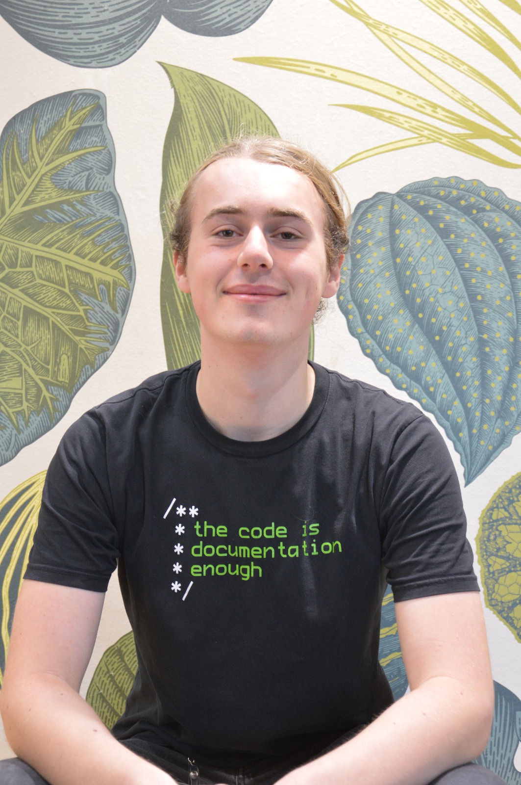

My name is Jonas. I'm currently a PhD student in Münster working in the
intersection of model theory, valuation theory and geometry.

My supervisors are [Franziska
Jahnke](https://ivv5hpp.uni-muenster.de/u/fjahn_01/en/) and [Konstantinos
Kartas](https://sites.google.com/view/kartaskostas).